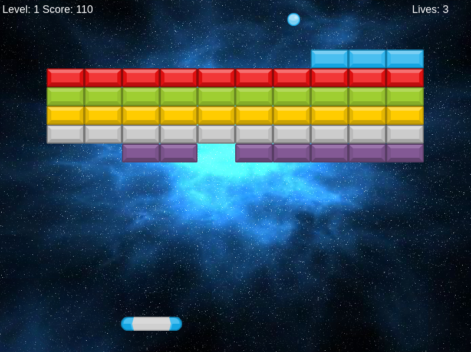

# Complex Breakout 2d

### Sobre o Projeto
O Complex Breakout 2D é um jogo estilo arcade inspirado no clássico Breakout, desenvolvido utilizando tecnologias modernas da web: HTML5, JavaScript, e o poderoso framework de desenvolvimento de jogos Phaser.io.

O game proporciona uma experiência envolvente, combinando gráficos dinâmicos, músicas cativantes e uma sofisticada detecção de colisões que garante a precisão durante a jogabilidade.

### Recursos Principais
- **Detecção Precisa de Colisões**: O sistema de colisão robusto permite interações suaves entre a bola, tijolos e outros elementos.
- **Trilha Sonora Dinâmica**: Músicas e efeitos sonoros imersivos que acompanham a ação do jogo.
- **Gráficos Dinâmicos**: Visual elegante e responsivo renderizado com Phaser.io.

### Tecnologias Utilizadas
- **HTML5**: Estrutura base do jogo.
- **JavaScript**: Lógica de negócio e interações.
- **Phaser.io**: Framework para desenvolvimento de jogos 2D.

### Como Jogar
1. Abra o jogo em qualquer navegador moderno que suporte HTML5.
2. Utilize as setas do teclado ou controles definidos para mover a barra.
3. Rebata a bola para destruir todos os tijolos.
4. Complete cada nível sem deixar a bola cair.

### Instalação
Para rodar o projeto localmente:
1. Clone o repositório:
```javascript
git clone https://github.com/rodrigoaguerra/complex-breakout-2d.git
```
2. Navegue até o diretório do projeto:
```bash
cd complex-breakout-2d
```
3. Inicie um servidor local:
```bash
npx http-server .
```

### Capturas de Tela



### Contribuição
1. Fork o repositório.
2. Crie uma nova branch para a funcionalidade.
3. Envie um Pull Request.

### Link do Projeto

[Acesse o Jogo Por Aqui](https://rodrigoaguerra.github.io/complex-breakout-2d/)